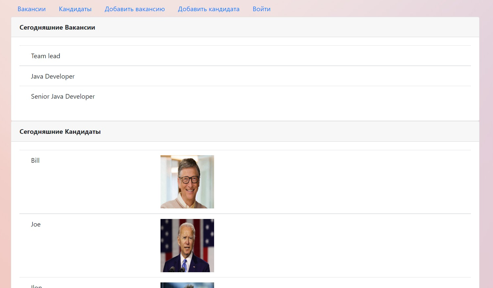
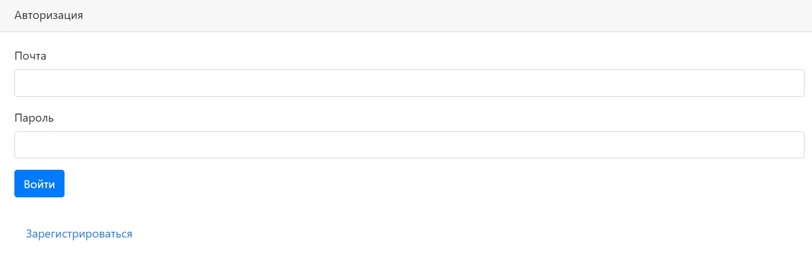
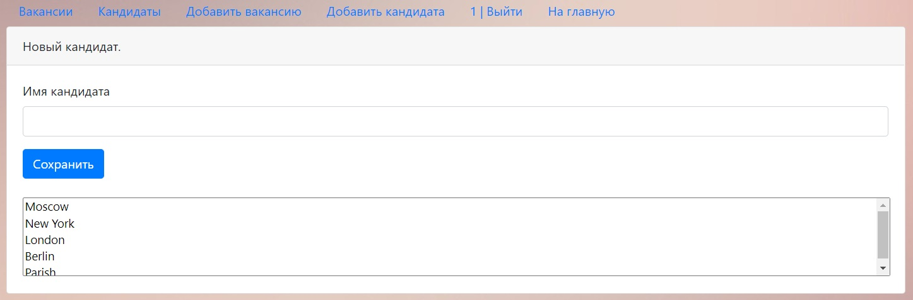
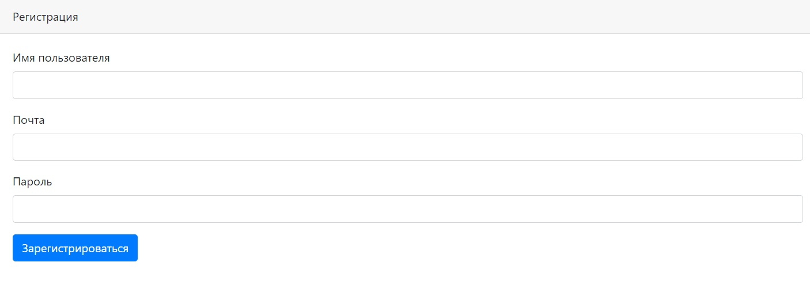

# Проект работа мечты 

Dream Job project.
Application works with java servlets, database Postgres, AJAX.
Frontend: jQuery, HTML, CSS, Bootstrap, JavaScript. 

This application provides the following functionality: add a candidate, upload a candidate's photo to the server, 
also delete candidate with his photo from the server.
Registration for users and check login / password coincidence, add vacancies. 
You can see the main page index.jsp, this page shows current posts and candidates of this day. 

